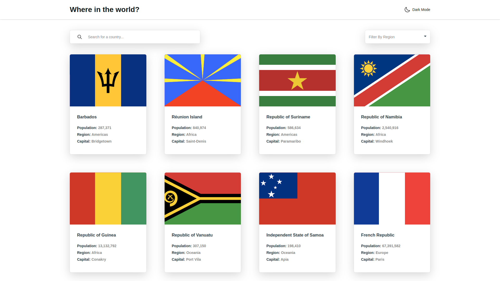

# Frontend Mentor - REST Countries API with color theme switcher solution

This is a solution to the [REST Countries API with color theme switcher challenge on Frontend Mentor](https://www.frontendmentor.io/challenges/rest-countries-api-with-color-theme-switcher-5cacc469fec04111f7b848ca). Frontend Mentor challenges help you improve your coding skills by building realistic projects.

## Table of contents

- [Overview](#overview)
  - [Screenshot](#screenshot)
  - [Links](#links)

## Overview

### Screenshot

### Links

- Solution URL: [GitHub](https://github.com/wingedotter5/rest-countries-api)
- Live Site URL: [GitHub Pages](https://wingedotter5.github.io/rest-countries-api)
